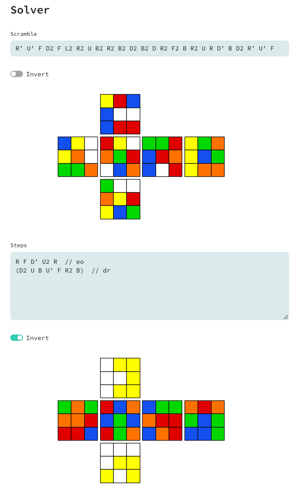

# Spruce - Rubiks Cube Solver


General purpose $n \times n$, where $1 \le n \le 10$, Rubik's cube solver and analytics engine.

Help is appreciated! Please reach out if you want to create an awesome app with me!



## Backlog

* Maintainace:
  * [] Improve the rotation solver, possibilly with new symmetry class
  * [] Finalize unit tests for tags
  * [PROGRESS] Finalize unit tests for move sequence, generator and algorithms
  * [DONE] Finalize unit tests for states, permutations and masks
  * [DONE] Switch from flake8 to ruff
  * [DONE] Rename 'state' to 'representation'
  * [DONE] Finalize unit tests for parsing of text and moves
  * [DONE] Use Google-style docstrings
  * [DONE] Bug with wide moves not being parsed properly on big cubes
  * [DONE] Use type definitions for cube state
  * [DONE] Configure logging
  * [DONE] Consistent usage of __init__.py as hierarchy for folders
  * [DONE] Switch package manager from poetry to uv
  * [DONE] Add codespell
* Autotagger:
  * [] Add symmetry class for easily configuring symmetric tags
  * [DONE] Check that a tag is "contained" in another
  * [DONE] Return scramble, steps and final so toggling is faster in UI
  * [DONE] 10x faster calculation of "entropy"
  * [DONE] Rank patterns in auto-tagger by "entropy"
  * [DONE] Make Cubex only use CubePattern, should not need mask and pattern
* Solver:
  * [] Add inverse transformations to IndexOptimizer
  * [] Make the bidirectional solver into a class
  * [PROGRESS] Fix Integrity of the Bidirectional Solver (alternative paths, dead moves)
  * [PROGRESS] Add parsing of "slashed" moves
  * [DONE] Use canonical ordering of actions for deterministic branching
  * [DONE] Use information about commutative actions to reduce effective branching factor
  * [DONE] Use information about inverse and complete actions to reduce branching factor
  * [DONE] Adaptive branching to reduce branching factor
  * [DONE] Be able to use custom move algorithms in the solver
  * [DONE] Remove isomorphic subgroups when compiling before the solver
  * [DONE] Returns solutions and search summary
* Beam-Searcher:
  * Design functionality (async/multithreading, parameters)
  * Estimatation of the expected length of a solution based on tag
  * Create multi-tag solving template and pipeline
* Feature ideas for autotagger:
  * Copilot to automatically complete comments and skeletons
  * Add subsets to autotagger. E.g. recognition for DR and HTR subsets
  * Easy way in UI to add patterns and algorithms for all cube sizes
* Feature ideas to solver:
  * Multi-tag solving
  * Add metrics to the solver for weighted searching
  * Prune actions using heuristics
  * Exploit rotations and symmetries to reduce branching factor
  * Rust bindings for faster solver
  * [ABANDONED] Create a custom fast inverse hash function
  * [ABANDONED] Add a burn-in depth for faster solving when minimal depth is deep
* Other ideas:
  * 3D graphics
  * Host the web-application
  * Use TypeScript + FastAPI instead of Streamlit
  * Database to store algorithms and attempts
  * Tool for shortening a sequence of moves
  * Tool for finding insertions? (by Baiqiang: [git](https://github.com/Baiqiang/333.fm))
  * [PROGRESS] Tool for scrambling. (Implement the official WCA scrambling generator or csTimer generator)

## What's this?

* `pyproject.toml`: Python configuration file for system requirements, metadata and dependencies.
* `rubiks_cube/app.py`: The app that gets run by [`streamlit`](https://docs.streamlit.io/)

## Local Setup

Assumes working python 3.13 installation and some command line knowledge.

```shell
# Clone repository
git clone https://github.com/martintufte/rubiks-cube

# Navigate to the directory
cd rubiks-cube

# Install uv (if not already installed)
curl -LsSf https://astral.sh/uv/install.sh | sh  # for Linux/macOS
# or: pip install uv

# Install dependencies
uv sync --all-groups

# Run the app
uv run streamlit run rubiks_cube/app.py
```

Open your browser to [http://localhost:8501/](http://localhost:8501/) if it doesn't open automatically.
